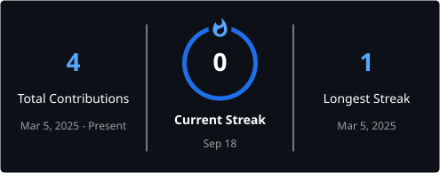

 

---

## About Me

I'm **Sean Ooi**, a curious developer who enjoys learning by building.

This profile is where I document my progress, turn ideas into working projects, and share what I discover along the way.

- Exploring **software development and artificial intelligence**
- Learning through **hands-on projects and experiments**
- Interested in building products that are **useful, clear, and enjoyable to use**
- Always improving one commit at a time

---

## Current Focus

I'm currently building a strong foundation in modern development while growing a portfolio of practical projects.

  
  
  
  

---

# Featured Projects

<table>
<tr>
<td width="50%" valign="top">

### 🚀 First Featured Project

My first public project will appear here soon.

I plan to use this space to explain:

- The problem I wanted to solve
- The approach and tools I chose
- What I learned while building it
- How the project can be used or improved

**Status:** `In progress`

</td>
<td width="50%" valign="top">

### 🧪 Experiments & Learning

Small experiments are where ideas become skills.

This section will feature:

- Coding exercises and prototypes
- AI and automation experiments
- Useful utilities
- Notes from technical deep dives

**Status:** `Building in public`

</td>
</tr>
</table>

> As repositories are published, replace these cards with links, screenshots, results, and the real technology used.

---

## Currently Exploring

### Languages & Web

  
  
  
  
  

### Development Tools

  
  
  

---

## Areas of Interest

  
  
  
  
  

---

# GitHub Analytics

 

---

## My Contribution Graph

---

### 💡 Learn. Build. Share. Improve.

I'm at the beginning of this GitHub journey, and every project here will tell part of the story.

 

